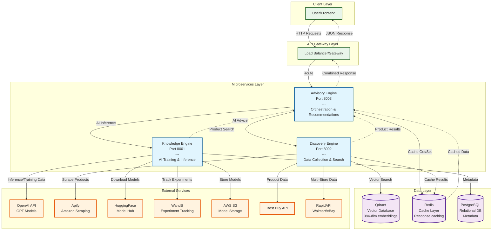

# ShopSense-AI

**Intelligent Shopping Assistant Platform**

ShopSense-AI is a microservices-based shopping intelligence platform that provides AI-powered product recommendations, semantic search, and personalized shopping consultation.

## Overview

A production-ready platform combining LLM training, vector search, and intelligent product discovery to deliver comprehensive shopping assistance.

### Key Features

- **AI-Powered Recommendations**: Fine-tuned LLMs using QLoRA for shopping assistance
- **Semantic Product Search**: Vector embeddings with Qdrant for similarity-based discovery
- **Price Monitoring**: Real-time deal detection and price tracking
- **Shopping Consultation**: Conversational AI for personalized advice
- **Product Comparison**: Multi-criteria analysis and ranking
- **Multi-Store Integration**: Amazon, Best Buy, Walmart, eBay support

### Architecture

Three independent microservices communicating via REST APIs:

- **[Knowledge Engine](services/knowledge_engine/README.md)** (Port 8001) - LLM training, model management, and AI inference
- **[Discovery Engine](services/discovery_engine/README.md)** (Port 8002) - Product data collection and semantic search
- **[Advisory Engine](services/advisory_engine/README.md)** (Port 8003) - User-facing recommendations and consultation

#### System Architecture Diagram



## Quick Start

### Prerequisites

- **Docker & Docker Compose**: For containerized deployment
- **API Keys**: Required external service credentials
- **Python 3.9+**: For local development
- **UV Package Manager**: For dependency management

### 1. Clone Repository

```bash
git clone <repository-url>
cd ShopSense-AI
```

### 2. Configure Environment

Create environment files for API credentials:

```bash
# Create .env file in project root
cp .env.example .env
```

**Required API Keys**:

```bash
# Knowledge Engine
KNOWLEDGE_OPENAI_API_KEY=sk-your-openai-key
KNOWLEDGE_HF_TOKEN=hf_your-huggingface-token
KNOWLEDGE_WANDB_API_KEY=your-wandb-key

# Discovery Engine
DISCOVERY_APPIFY_API_KEY=your-appify-key

# Advisory Engine
ADVISORY_OPENAI_API_KEY=sk-your-openai-key

# Optional APIs
DISCOVERY_BESTBUY_API_KEY=your-bestbuy-key
DISCOVERY_RAPIDAPI_KEY=your-rapidapi-key
```

### 3. Start the Platform

**Option A: Full Platform (Recommended)**
```bash
# Start all services with databases
docker-compose up -d

# Check service health
curl http://localhost:8001/health  # Knowledge Engine
curl http://localhost:8002/health  # Discovery Engine
curl http://localhost:8003/health  # Advisory Engine
```

**Option B: Development Mode**
```bash
# Start only databases
docker-compose up -d qdrant postgres redis

# Run services individually (in separate terminals)
cd services/knowledge_engine && uv run python -m api.main
cd services/discovery_engine && uv run python -m api.main
cd services/advisory_engine && uv run python -m api.main
```

### 4. Verify Installation

```bash
# Test the full pipeline
curl -X POST "http://localhost:8003/api/v1/search" \
  -H "Content-Type: application/json" \
  -d '{
    "query": "gaming laptop under $1500",
    "budget_range": {"min": 1000, "max": 1500}
  }'
```

## Service Documentation

Each service provides comprehensive documentation and interactive API exploration:

| Service | Port | Interactive Docs | Service README |
|---------|------|------------------|----------------|
| **Knowledge Engine** | 8001 | http://localhost:8001/docs | [README](services/knowledge_engine/README.md) |
| **Discovery Engine** | 8002 | http://localhost:8002/docs | [README](services/discovery_engine/README.md) |
| **Advisory Engine** | 8003 | http://localhost:8003/docs | [README](services/advisory_engine/README.md) |

### Quick API Examples

**Trigger Product Collection:**
```bash
curl -X POST "http://localhost:8002/api/v1/products/collect" \
  -H "Content-Type: application/json" \
  -d '{"sources": ["amazon"], "categories": ["PS5 Controller"], "max_results": 20}'
```

**Semantic Product Search:**
```bash
curl "http://localhost:8002/api/v1/products/search?query=gaming+controller&limit=10"
```

**Get Product Details:**
```bash
curl "http://localhost:8002/api/v1/products/amazon_B0DTP6BRVL"
```

For complete API documentation, examples, and integration guides, see the individual service READMEs linked above.

## Development

### Project Structure

```
shopsense-ai/
├── services/                    # Microservices
│   ├── knowledge_engine/        # AI Training & Inference
│   │   ├── api/                # FastAPI routes & schemas
│   │   ├── core/               # Training, evaluation, data
│   │   ├── config/             # Settings & configuration
│   │   └── Dockerfile
│   ├── discovery_engine/        # Data Collection & Search
│   │   ├── api/                # FastAPI routes & schemas
│   │   ├── core/               # Collectors, processors, storage
│   │   ├── config/             # Settings & configuration
│   │   └── Dockerfile
│   └── advisory_engine/         # User-Facing Intelligence
│       ├── api/                # FastAPI routes & schemas
│       ├── clients/            # Service clients
│       ├── core/               # Recommendations & consultation
│       ├── config/             # Settings & configuration
│       └── Dockerfile
├── core/                       # Shared utilities
│   ├── logging.py             # Centralized logging
│   └── config.py              # Base configuration
└── docker-compose.yml         # Container orchestration
```

### Local Development

#### Setup Development Environment

```bash
# Install UV package manager
curl -LsSf https://astral.sh/uv/install.sh | sh

# Setup each service
cd services/knowledge_engine
uv sync
cd ../discovery_engine
uv sync
cd ../advisory_engine
uv sync
```

#### Install Core Package in Services

```bash
# In each service directory
uv add core --path ../../core
```

#### Run Tests

```bash
# Run service-specific tests
cd services/knowledge_engine
uv run pytest

# Run integration tests
cd ../../
uv run pytest tests/
```

## Configuration

### Environment Variables

Each service uses environment variables with service-specific prefixes:

- **Knowledge Engine**: `KNOWLEDGE_*` - See [Knowledge Engine configuration](services/knowledge_engine/README.md#configuration)
- **Discovery Engine**: `DISCOVERY_*` - See [Discovery Engine configuration](services/discovery_engine/README.md#configuration)
- **Advisory Engine**: `ADVISORY_*` - See [Advisory Engine configuration](services/advisory_engine/README.md#configuration)

### Required API Keys

```bash
# Core Services
KNOWLEDGE_OPENAI_API_KEY=sk-xxx      # OpenAI for AI inference
KNOWLEDGE_HUGGINGFACE_TOKEN=hf_xxx   # HuggingFace for models
KNOWLEDGE_WANDB_API_KEY=xxx          # WandB for experiment tracking
KNOWLEDGE_WANDB_ENTITY=your-team     # WandB team name (required)

DISCOVERY_APIFY_API_KEY=xxx          # Apify for product scraping
ADVISORY_OPENAI_API_KEY=sk-xxx       # OpenAI for consultations

# Optional APIs
DISCOVERY_BESTBUY_API_KEY=xxx        # Best Buy API
DISCOVERY_RAPIDAPI_KEY=xxx           # RapidAPI for Walmart/eBay
KNOWLEDGE_S3_BUCKET=xxx              # S3 for model storage (optional)
```

For detailed configuration options, see:
- [docker-compose.yml](docker-compose.yml) - Container orchestration settings
- Individual service `.env.example` files for all available options

## Monitoring & Operations

### Health Checks

```bash
# Service health endpoints
curl http://localhost:8001/health
curl http://localhost:8002/health
curl http://localhost:8003/health

# Database health
docker-compose exec postgres pg_isready
docker-compose exec redis redis-cli ping
docker-compose exec qdrant curl http://localhost:6333/health
```

### Logs & Debugging

```bash
# View service logs
docker-compose logs knowledge-service
docker-compose logs discovery-service
docker-compose logs advisory-service

# Follow logs in real-time
docker-compose logs -f advisory-service

# Debug specific container
docker-compose exec advisory-service /bin/bash
```

### Performance Monitoring

```bash
# Enable monitoring stack (uncomment in docker-compose.yml)
# - Prometheus: http://localhost:9090
# - Grafana: http://localhost:3000 (admin/admin)

# View container stats
docker stats
```

## Deployment

### Production Deployment

1. **Configure Production Environment**
```bash
cp .env.example .env.prod
# Update with production credentials and URLs
```

2. **Deploy with Production Settings**
```bash
docker-compose -f docker-compose.yml -f docker-compose.prod.yml up -d
```

3. **Setup SSL/TLS (Recommended)**
```bash
# Use nginx-proxy or traefik for SSL termination
# Configure domain names and certificates
```

### Scaling Services

```bash
# Scale specific services
docker-compose up -d --scale advisory-service=3
docker-compose up -d --scale discovery-service=2

# Use load balancer for distribution
```

## Contributing

### Development Workflow

1. **Fork & Clone**: Fork the repository and clone locally
2. **Branch**: Create feature branch (`git checkout -b feature/amazing-feature`)
3. **Develop**: Make changes following coding standards
4. **Test**: Run tests and ensure all pass
5. **Commit**: Commit with clear messages
6. **Push**: Push to your fork and create pull request

### Code Standards

- **Python**: Follow PEP 8, use type hints
- **FastAPI**: Use Pydantic models for validation
- **Documentation**: Comprehensive docstrings required
- **Testing**: Unit tests for core functionality
- **Logging**: Use structured logging throughout

## License

This project is licensed under the MIT License - see the [LICENSE](LICENSE) file for details.

## Support

### Common Issues

**Services won't start**:
- Check API keys are set correctly
- Verify Docker is running
- Check port availability (8001-8003, 5432, 6333, 6379)

**API calls failing**:
- Verify service health endpoints
- Check service logs for errors
- Ensure database connections are working

**Performance issues**:
- Monitor resource usage with `docker stats`
- Check database connection pools
- Verify network connectivity between services

### Getting Help

- **Documentation**: Check service-specific `/docs` endpoints
- **Issues**: Open GitHub issue with details
- **Logs**: Include relevant service logs
- **Configuration**: Verify environment variables

## Roadmap

- [ ] **Enhanced AI Models**: Custom shopping domain models
- [ ] **More Data Sources**: Additional e-commerce platforms
- [ ] **User Profiles**: Persistent user preferences and history
- [ ] **Mobile API**: Mobile-optimized endpoints
- [ ] **Analytics Dashboard**: Usage and performance metrics
- [ ] **A/B Testing**: Recommendation algorithm testing
- [ ] **Multi-language**: Support for multiple languages

---

**Author**: [Yasser El Haddar](mailto:yasserelhaddar@gmail.com)

**Built with FastAPI, Qdrant, OpenAI, and modern Python**