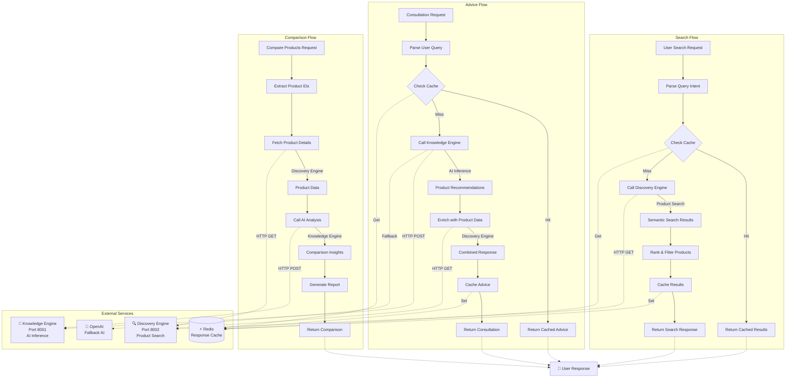

# Advisory Engine

User-facing recommendations and consultation service for ShopSense-AI.

## Overview

The Advisory Engine is the orchestration layer that:
- Provides AI-powered product search with natural language understanding
- Delivers personalized shopping consultation through conversational AI
- Performs intelligent product comparison across multiple criteria
- Manages user authentication and activity tracking with privacy controls
- Coordinates between Discovery Engine (product data) and Knowledge Engine (AI inference)
- Implements response caching and user data persistence for performance optimization

### Service Architecture



## Quick Start

### Prerequisites
- Python 3.9+
- UV package manager
- Docker (for Redis user data & caching)
- Running Discovery Engine (port 8002)
- Running Knowledge Engine (port 8001)
- Clerk account for authentication (production)

### Installation

```bash
cd services/advisory_engine
uv sync
```

For development with testing tools:
```bash
uv sync --extra dev
```

### Configuration

Copy the example environment file and configure:

```bash
cp config/.env.example config/.env
```

Edit `config/.env` with your settings:

```bash
# Required
ADVISORY_OPENAI_API_KEY=sk-your-openai-key-here

# Service URLs
ADVISORY_DISCOVERY_SERVICE_URL=http://localhost:8002
ADVISORY_KNOWLEDGE_SERVICE_URL=http://localhost:8001

# CORS Configuration (comma-separated origins, or '*' for dev)
ADVISORY_ALLOWED_ORIGINS=*

# Model Configuration
ADVISORY_DEFAULT_MODEL_ID=shopping_advisor_production_v2

# Authentication (Clerk)
ADVISORY_AUTH_ENABLED=true
ADVISORY_CLERK_PUBLISHABLE_KEY=pk_test_your-key
ADVISORY_CLERK_SECRET_KEY=sk_test_your-secret
ADVISORY_CLERK_ISSUER=https://your-app.clerk.accounts.dev

# Redis for User Data & Caching
ADVISORY_REDIS_URL=redis://localhost:6379
ADVISORY_CACHE_ENABLED=true
```

See `config/.env.example` for all available configuration options.

### Start Redis Cache (Optional)

```bash
docker run -d -p 6379:6379 --name redis redis:7-alpine
```

### Run the Service

```bash
uv run python -m api.main
```

Visit http://localhost:8003/docs for interactive API documentation.

## API Endpoints

All endpoints are prefixed with `/api/v1` and require authentication (except `/health`):

### Product & Recommendations
- `POST /api/v1/search` - AI-powered product search with auto-tracking
- `POST /api/v1/advice` - Shopping consultation with conversation history auto-tracking
- `POST /api/v1/compare` - Multi-product comparison
- `GET /api/v1/recommendations/trending` - Trending product recommendations

### User Management
- `POST /api/v1/feedback` - Submit product feedback and ratings
- `GET /api/v1/user/preferences` - Get user preferences and history
- `PUT /api/v1/user/preferences` - Update shopping preferences
- `DELETE /api/v1/user/clear-history` - Clear all user activity history

### Service Health
- `GET /api/v1/health` - Health check endpoint (public)

**Note**: Activity tracking is enabled by default (opt-out model). Users can disable tracking via preferences.

## Development

### Run Tests
```bash
uv run pytest
uv run pytest --cov  # With coverage
```

### Run with Auto-Reload
```bash
uv run uvicorn api.main:app --reload --port 8003
```

### Linting
```bash
uv run ruff check .
uv run ruff format .
```

## Docker

### Build Image
```bash
docker build -t shopsense-advisory:latest .
```

### Run Container
```bash
docker run -d \
  -p 8003:8003 \
  --env-file config/.env \
  --name advisory-engine \
  shopsense-advisory:latest
```

## Architecture

The Advisory Engine acts as an API gateway with user management that:
1. **Authentication & Authorization** - Validates JWT tokens via Clerk middleware
2. **Query Processing** - Receives user queries and extracts intent
3. **Product Discovery** - Calls Discovery Engine for semantic product search
4. **AI Inference** - Calls Knowledge Engine for AI-powered advice
5. **Response Optimization** - Combines and ranks results based on user preferences
6. **Performance Caching** - Caches responses in Redis for speed
7. **User Data Management** - Manages user preferences (Clerk) and history (Redis)

### Data Storage Strategy

**Clerk (User Authentication & Preferences)**:
- User authentication and JWT tokens
- Lightweight shopping preferences (~200-500 bytes)
- Tracking preferences (opt-out model)

**Redis (Historical User Data)**:
- Conversation history (7-day TTL)
- Product recommendations (30-day TTL)
- User feedback (90-day TTL)
- Recently viewed products (30-day TTL)

## Production Deployment

### Required Environment Variables
- `ADVISORY_OPENAI_API_KEY` - OpenAI API key for fallback inference
- `ADVISORY_DISCOVERY_SERVICE_URL` - Discovery Engine endpoint
- `ADVISORY_KNOWLEDGE_SERVICE_URL` - Knowledge Engine endpoint
- `ADVISORY_ALLOWED_ORIGINS` - Comma-separated list of allowed CORS origins
- `ADVISORY_REDIS_URL` - Redis connection URL for user data and caching

### Authentication Configuration (Required for Production)
- `ADVISORY_AUTH_ENABLED` - Enable Clerk authentication (set to `true`)
- `ADVISORY_CLERK_PUBLISHABLE_KEY` - Clerk publishable key
- `ADVISORY_CLERK_SECRET_KEY` - Clerk secret key for backend verification
- `ADVISORY_CLERK_ISSUER` - Clerk issuer URL (e.g., `https://your-app.clerk.accounts.dev`)

### Optional Configuration
- `ADVISORY_DEFAULT_MODEL_ID` - Default model for Knowledge Engine requests
- `ADVISORY_HTTP_TIMEOUT_SECONDS` - HTTP client timeout (default: 60)
- `ADVISORY_HTTP_MAX_KEEPALIVE` - Max keepalive connections (default: 5)
- `ADVISORY_HTTP_MAX_CONNECTIONS` - Max total connections (default: 10)
- `ADVISORY_CACHE_ENABLED` - Enable response caching (default: true)

**Security Note**: When authentication is disabled (`ADVISORY_AUTH_ENABLED=false`), all endpoints become public. This should only be used in development environments.

See `config/.env.example` for all configuration options.