# Advisory Engine

User-facing recommendations and consultation service for ShopSense-AI.

## Overview

The Advisory Engine is the orchestration layer that:
- Provides AI-powered product search with natural language understanding
- Delivers personalized shopping consultation through conversational AI
- Performs intelligent product comparison across multiple criteria
- Coordinates between Discovery Engine (product data) and Knowledge Engine (AI inference)
- Implements response caching for performance optimization

### Service Architecture

```mermaid
graph TB
    subgraph "Search Flow"
        A[User Search Request] --> B[Parse Query Intent]
        B --> C{Check Cache}
        C -->|Hit| D[Return Cached Results]
        C -->|Miss| E[Call Discovery Engine]
        E -->|Product Search| F[Semantic Search Results]
        F --> G[Rank & Filter Products]
        G --> H[Cache Results]
        H --> I[Return Search Response]
    end

    subgraph "Advice Flow"
        J[Consultation Request] --> K[Parse User Query]
        K --> L{Check Cache}
        L -->|Hit| M[Return Cached Advice]
        L -->|Miss| N[Call Knowledge Engine]
        N -->|AI Inference| O[Product Recommendations]
        O --> P[Enrich with Product Data]
        P -->|Discovery Engine| Q[Combined Response]
        Q --> R[Cache Advice]
        R --> S[Return Consultation]
    end

    subgraph "Comparison Flow"
        T[Compare Products Request] --> U[Extract Product IDs]
        U --> V[Fetch Product Details]
        V -->|Discovery Engine| W[Product Data]
        W --> X[Call AI Analysis]
        X -->|Knowledge Engine| Y[Comparison Insights]
        Y --> Z[Generate Report]
        Z --> AA[Return Comparison]
    end

    subgraph "External Services"
        Discovery[🔍 Discovery Engine<br/>Port 8002<br/>Product Search]
        Knowledge[🧠 Knowledge Engine<br/>Port 8001<br/>AI Inference]
        Redis[(⚡ Redis<br/>Response Cache)]
        OpenAI[🤖 OpenAI<br/>Fallback AI]
    end

    %% Service Connections
    E -.->|HTTP GET| Discovery
    P -.->|HTTP GET| Discovery
    V -.->|HTTP GET| Discovery
    N -.->|HTTP POST| Knowledge
    X -.->|HTTP POST| Knowledge

    %% Cache Connections
    H -.->|Set| Redis
    C -.->|Get| Redis
    R -.->|Set| Redis
    L -.->|Get| Redis

    %% Fallback Connection
    N -.->|Fallback| OpenAI

    %% Response Flow
    D -.-> User[👤 User Response]
    I -.-> User
    M -.-> User
    S -.-> User
    AA -.-> User
```



## Quick Start

### Prerequisites
- Python 3.9+
- UV package manager
- Docker (for Redis caching)
- Running Discovery Engine (port 8002)
- Running Knowledge Engine (port 8001)

### Installation

```bash
cd services/advisory_engine
uv sync
```

For development with testing tools:
```bash
uv sync --extra dev
```

### Configuration

Copy the example environment file and configure:

```bash
cp config/.env.example config/.env
```

Edit `config/.env` with your settings:

```bash
# Required
ADVISORY_OPENAI_API_KEY=sk-your-openai-key-here

# Service URLs
ADVISORY_DISCOVERY_SERVICE_URL=http://localhost:8002
ADVISORY_KNOWLEDGE_SERVICE_URL=http://localhost:8001

# CORS Configuration (comma-separated origins, or '*' for dev)
ADVISORY_ALLOWED_ORIGINS=*

# Model Configuration
ADVISORY_DEFAULT_MODEL_ID=shopping_advisor_production_v2

# Optional: Redis Cache
ADVISORY_REDIS_URL=redis://localhost:6379
ADVISORY_CACHE_ENABLED=true
```

See `config/.env.example` for all available configuration options.

### Start Redis Cache (Optional)

```bash
docker run -d -p 6379:6379 --name redis redis:7-alpine
```

### Run the Service

```bash
uv run python -m api.main
```

Visit http://localhost:8003/docs for interactive API documentation.

## API Endpoints

All endpoints are prefixed with `/api/v1`:

- `POST /api/v1/search` - AI-powered product search
- `POST /api/v1/advice` - Shopping consultation with conversation history
- `POST /api/v1/compare` - Multi-product comparison
- `GET /api/v1/recommendations/trending` - Trending product recommendations
- `GET /api/v1/health` - Health check endpoint

## Development

### Run Tests
```bash
uv run pytest
uv run pytest --cov  # With coverage
```

### Run with Auto-Reload
```bash
uv run uvicorn api.main:app --reload --port 8003
```

### Linting
```bash
uv run ruff check .
uv run ruff format .
```

## Docker

### Build Image
```bash
docker build -t shopsense-advisory:latest .
```

### Run Container
```bash
docker run -d \
  -p 8003:8003 \
  --env-file config/.env \
  --name advisory-engine \
  shopsense-advisory:latest
```

## Architecture

The Advisory Engine acts as an API gateway that:
1. Receives user queries and extracts intent
2. Calls Discovery Engine for semantic product search
3. Calls Knowledge Engine for AI-powered advice
4. Combines and ranks results based on user preferences
5. Caches responses in Redis for performance

## Production Deployment

### Required Environment Variables
- `ADVISORY_OPENAI_API_KEY` - OpenAI API key for fallback inference
- `ADVISORY_DISCOVERY_SERVICE_URL` - Discovery Engine endpoint
- `ADVISORY_KNOWLEDGE_SERVICE_URL` - Knowledge Engine endpoint
- `ADVISORY_ALLOWED_ORIGINS` - Comma-separated list of allowed CORS origins

### Optional Configuration
- `ADVISORY_DEFAULT_MODEL_ID` - Default model for Knowledge Engine requests
- `ADVISORY_HTTP_TIMEOUT_SECONDS` - HTTP client timeout (default: 60)
- `ADVISORY_HTTP_MAX_KEEPALIVE` - Max keepalive connections (default: 5)
- `ADVISORY_HTTP_MAX_CONNECTIONS` - Max total connections (default: 10)

See `config/.env.example` for all configuration options.