# Discovery Engine

Product search, data collection, and deal monitoring service for ShopSense-AI.

## Overview

The Discovery Engine is responsible for:
- Semantic product search using vector embeddings
- Multi-store data collection (Amazon, Best Buy, Walmart, Target)
- Real-time deal monitoring and price tracking
- Vector database management with Qdrant
- Product data enrichment and processing

### Service Architecture

```mermaid
graph TB
    subgraph "Product Collection Flow"
        A[Collection Request] --> B{Select Source}
        B -->|Amazon| C[Apify Actor]
        B -->|Best Buy| D[Best Buy API]
        B -->|Walmart/eBay| E[RapidAPI]

        C --> F[Raw Product Data]
        D --> F
        E --> F

        F --> G[Clean & Normalize]
        G --> H[Generate Embeddings]
        H -->|sentence-transformers<br/>384-dim| I[Vector Embeddings]
        I --> J[Store in Qdrant]
        J --> K[Collection Complete]
    end

    subgraph "Product Search Flow"
        L[Search Query] --> M[Generate Query Embedding]
        M --> N[Vector Similarity Search]
        N -->|Qdrant| O[Similar Products]
        O --> P[Apply Filters]
        P -->|Price, Category<br/>Store, Brand| Q[Filter Results]
        Q --> R[Rank by Similarity]
        R --> S[Return Products]
    end

    subgraph "External Services"
        Apify[🕷️ Apify<br/>Amazon Scraping]
        BB[🏪 Best Buy<br/>Official API]
        Rapid[⚡ RapidAPI<br/>Multi-Store]
        Qdrant[(🗄️ Qdrant<br/>Vector DB)]
        Redis[(⚡ Redis<br/>Cache)]
    end

    C -.->|Scrape| Apify
    D -.->|Query| BB
    E -.->|API Call| Rapid
    J -.->|Upsert| Qdrant
    N -.->|Search| Qdrant
    S -.->|Cache| Redis
```



## Quick Start

### Prerequisites
- Python 3.9+
- UV package manager
- Docker (for Qdrant vector database)
- API keys for Apify, Best Buy, and RapidAPI (optional)

### Installation

```bash
cd services/discovery_engine
uv sync
```

For development with testing tools:
```bash
uv sync --extra dev
```

### Configuration

Copy the example environment file and configure:

```bash
cp config/.env.example config/.env
```

Edit `config/.env` with your settings:

```bash
# Required
DISCOVERY_APIFY_API_KEY=your-apify-key-here

# Vector Database
DISCOVERY_QDRANT_URL=http://localhost:6333

# CORS Configuration (comma-separated origins, or '*' for dev)
DISCOVERY_ALLOWED_ORIGINS=*

# Optional: Multi-Store APIs
DISCOVERY_BESTBUY_API_KEY=your-bestbuy-key
DISCOVERY_RAPIDAPI_KEY=your-rapidapi-key
```

See `config/.env.example` for all available configuration options.

### Start Qdrant Vector Database

```bash
docker run -d \
  -p 6333:6333 \
  -v $(pwd)/qdrant_data:/qdrant/storage \
  --name qdrant \
  qdrant/qdrant
```

### Run the Service

```bash
uv run python -m api.main
```

Visit http://localhost:8002/docs for interactive API documentation.

## API Endpoints

All endpoints are prefixed with `/api/v1`:

- `GET /api/v1/products/search` - Search products with semantic similarity
- `GET /api/v1/products/{id}` - Get specific product details
- `GET /api/v1/deals` - Get current deals and price drops
- `POST /api/v1/products/collect` - Trigger data collection
- `GET /api/v1/health` - Health check endpoint

## Development

### Run Tests
```bash
uv run pytest
uv run pytest --cov  # With coverage
```

### Run with Auto-Reload
```bash
uv run uvicorn api.main:app --reload --port 8002
```

### Linting
```bash
uv run ruff check .
uv run ruff format .
```

## Docker

### Build Image
```bash
docker build -t shopsense-discovery:latest .
```

### Run Container
```bash
docker run -d \
  -p 8002:8002 \
  --env-file config/.env \
  --name discovery-engine \
  shopsense-discovery:latest
```

## Architecture

The Discovery Engine workflow:
1. Collects product data from multiple e-commerce platforms via Apify actors
2. Generates semantic embeddings using sentence-transformers
3. Stores vectors in Qdrant for similarity search
4. Provides REST API for product search and retrieval
5. Monitors prices and detects deals in real-time

## Data Collection

### Supported Platforms
- **Amazon** - Via Apify Actor (primary source)
- **Best Buy** - Official API integration
- **Walmart** - RapidAPI integration
- **eBay** - RapidAPI integration

### Collection Configuration

Configure in `config/.env`:
```bash
DISCOVERY_COLLECTION_BATCH_SIZE=50
DISCOVERY_MAX_CONCURRENT_COLLECTIONS=3
DISCOVERY_APIFY_RATE_LIMIT=10
```

### Trigger Collection

```bash
curl -X POST "http://localhost:8002/api/v1/products/collect" \
  -H "Content-Type: application/json" \
  -d '{"query": "laptop", "max_products": 100}'
```

## Documentation

For complete documentation, see:
- [Service Documentation](../../docs/discovery_engine.md)
- [API Reference](../../docs/api/discovery_api.md)
- [Configuration Guide](./config/.env.example)

## Production Deployment

### Required Environment Variables
- `DISCOVERY_APIFY_API_KEY` - Apify API key for product scraping
- `DISCOVERY_QDRANT_URL` - Qdrant vector database endpoint
- `DISCOVERY_ALLOWED_ORIGINS` - Comma-separated list of allowed CORS origins

### Vector Database Setup

For production with persistent storage:
```bash
docker run -d \
  -p 6333:6333 \
  -v /path/to/persistent/storage:/qdrant/storage \
  --restart unless-stopped \
  --name qdrant-prod \
  qdrant/qdrant
```

### Performance Tuning
- `DISCOVERY_MAX_CONCURRENT_SEARCHES` - Max parallel search requests (default: 10)
- `DISCOVERY_SEARCH_TIMEOUT_SECONDS` - Search timeout (default: 30)
- `DISCOVERY_HTTP_POOL_SIZE` - HTTP connection pool size (default: 100)

See `config/.env.example` for all configuration options.