# Knowledge Engine

AI model training, management, and inference service for ShopSense-AI.

## Overview

The Knowledge Engine is responsible for:
- Fine-tuning LLMs using QLoRA on shopping conversation data
- Managing trained models with version control and S3 storage
- Serving AI inference for product recommendations
- Generating synthetic training data using OpenAI
- Tracking experiments with WandB (Weights & Biases)

### Service Architecture

```mermaid
graph TB
    subgraph "Training Flow"
        A[Start Training Request] --> B[Generate Training Data]
        B -->|OpenAI API| C[Synthetic Conversations]
        C --> D[Load Base Model]
        D -->|HuggingFace| E[Mistral-7B/GPT-2]
        E --> F[Apply QLoRA]
        F --> G[Fine-tune Model]
        G -->|WandB| H[Track Metrics]
        H --> I[Save Model]
        I -->|Local/S3| J[Model Storage]
        J --> K[Model Ready]
    end

    subgraph "Inference Flow"
        L[Inference Request] --> M[Load Model]
        M --> N[Process Query]
        N --> O[Generate Response]
        O --> P[Return Advice]
    end

    subgraph "External Services"
        OpenAI[🤖 OpenAI<br/>Data Generation]
        HF[🤗 HuggingFace<br/>Base Models]
        WandB[📊 WandB<br/>Experiments]
        S3[☁️ S3<br/>Storage]
    end

    B -.->|API Call| OpenAI
    D -.->|Download| HF
    H -.->|Log| WandB
    I -.->|Upload| S3
    M -.->|Fetch| S3
```



## Quick Start

### Prerequisites
- Python 3.9+
- UV package manager
- API keys for OpenAI, HuggingFace, and WandB
- Optional: AWS credentials for S3 model storage
- Optional: GPU with CUDA support for training

### Installation

```bash
cd services/knowledge_engine
uv sync
```

For development with testing tools:
```bash
uv sync --extra dev
```

For GPU training with CUDA support:
```bash
uv sync --extra gpu
```

### Configuration

Copy the example environment file and configure:

```bash
cp config/.env.example config/.env
```

Edit `config/.env` with your settings:

```bash
# Required
KNOWLEDGE_OPENAI_API_KEY=sk-your-openai-key-here
KNOWLEDGE_HUGGINGFACE_TOKEN=hf_your-huggingface-token
KNOWLEDGE_WANDB_API_KEY=your-wandb-api-key
KNOWLEDGE_WANDB_ENTITY=your-team-name

# CORS Configuration (comma-separated origins, or '*' for dev)
KNOWLEDGE_ALLOWED_ORIGINS=*

# Optional: S3 Model Storage
KNOWLEDGE_S3_BUCKET=your-s3-bucket-name
KNOWLEDGE_AWS_REGION=us-east-1
```

See `config/.env.example` for all available configuration options.

### Run the Service

```bash
uv run python -m api.main
```

Visit http://localhost:8001/docs for interactive API documentation.

## API Endpoints

All endpoints are prefixed with `/api/v1`:

- `POST /api/v1/train` - Start model training job
- `GET /api/v1/models` - List available models
- `POST /api/v1/models/{id}/inference` - Run inference with specific model
- `POST /api/v1/data/generate` - Generate synthetic training data
- `GET /api/v1/training/status/{job_id}` - Check training job status
- `GET /api/v1/health` - Health check endpoint

## Development

### Run Tests
```bash
uv run pytest
uv run pytest --cov  # With coverage
```

### Run with Auto-Reload
```bash
uv run uvicorn api.main:app --reload --port 8001
```

### Linting
```bash
uv run ruff check .
uv run ruff format .
```

## Docker

### Build Image
```bash
docker build -t shopsense-knowledge:latest .
```

### Run Container
```bash
docker run -d \
  -p 8001:8001 \
  --env-file config/.env \
  --name knowledge-engine \
  shopsense-knowledge:latest
```

For GPU training, use the nvidia runtime:
```bash
docker run -d \
  -p 8001:8001 \
  --gpus all \
  --env-file config/.env \
  --name knowledge-engine \
  shopsense-knowledge:latest
```

## Architecture

The Knowledge Engine workflow:
1. Generates synthetic training data using OpenAI GPT models
2. Processes conversation data and prepares datasets
3. Fine-tunes base LLMs using QLoRA (Quantized Low-Rank Adaptation)
4. Tracks training experiments with WandB for metrics and visualization
5. Saves trained models to S3 with version control
6. Serves inference API for shopping recommendations and advice
7. Manages model lifecycle and deployment

## Production Deployment

### Required Environment Variables
- `KNOWLEDGE_OPENAI_API_KEY` - OpenAI API key for data generation
- `KNOWLEDGE_HUGGINGFACE_TOKEN` - HuggingFace token for model access
- `KNOWLEDGE_WANDB_API_KEY` - WandB API key for experiment tracking
- `KNOWLEDGE_WANDB_ENTITY` - WandB entity/team name (no default)
- `KNOWLEDGE_ALLOWED_ORIGINS` - Comma-separated list of allowed CORS origins

### Optional Configuration
- `KNOWLEDGE_S3_BUCKET` - S3 bucket for model storage (if using S3)
- `KNOWLEDGE_AWS_REGION` - AWS region for S3 (default: us-east-1)
- `KNOWLEDGE_BASE_MODEL` - Base model for fine-tuning (default: meta-llama/Llama-2-7b-hf)

### GPU Configuration
For production training with GPU:
```bash
# Install GPU dependencies
uv sync --extra gpu

# Verify CUDA availability
python -c "import torch; print(torch.cuda.is_available())"
```

See `config/.env.example` for all configuration options.